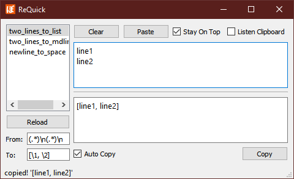

# ReQuick

Do [re.sub(pattern, repl, string)][re.sub] with a YAML list and GUI.

Relpace a srting wirh regex pattern. Quick and easy.

[re.sub]: https://docs.python.org/3/library/re.html#re.sub



## Features

- GUI
- Auto copy
- Listen clopbpard
- Stay on top

## How to use

1. Install [Python 3.7+][Python].
2. Install packages, installing with `virtualenv` is recommended.

    ```batch
    pip install -r requirements.txt
    ```

3. Run script.

    ```batch
    python main.py
    ```

[Python]: https://www.python.org/
